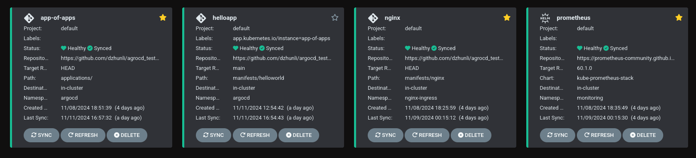
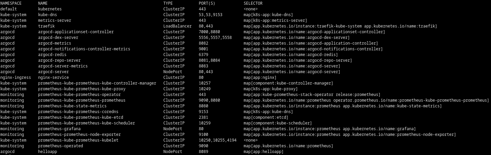

#  EXAMPLE OF USING ARGOCD
 - convenient because it's all in one docker container
 - app-of-apps approach
 - example of adding a custom application
 - prometheus monitoring included

[](https://github.com/dzhunli/argocd_tests/actions/workflows/build-push.yml)




---


## Requirements
1. You must have Linux
2. Нou need to install docker if it is not already installed on your system
docker --> please visit https://docs.docker.com/engine/install/ (you don`t need docker desktop ONLY docker engine)
3. Read about privileged containers https://docs.docker.com/engine/containers/run/

## Install #1
- Run k3s server in docker container 
```bash
    docker run -d --name k3s-server --privileged --restart=unless-stopped --network=host rancher/k3s:v1.26.0-k3s1 server
```

**THE COMMANDS BELOW NEED TO BE EXECUTED INSIDE THE CONTAINER**

- Setup some envs 
 ```bash
    cat /etc/rancher/k3s/k3s.yaml > k3s.yaml && export KUBECONFIG=$PWD/k3s.yaml
```

- Create namespace for argocd
 ```bash
   kubectl create namespace argocd
```

-  Apply argocd masnifest in created namespace
 ```bash
   kubectl apply -n argocd -f https://raw.githubusercontent.com/argoproj/argo-cd/stable/manifests/install.yaml
```

-  Wait needed condition for next steps 
 ```bash
kubectl wait --for=condition=available --timeout=300s -n argocd deployment/argocd-server
```

-  Set up NodePort for web 
 ```bash
NODE_PORT=$(kubectl get svc argocd-server -n argocd -o jsonpath='{.spec.ports[0].nodePort}')
```

-  Create admin password 
 ```bash
ARGOCD_PASSWORD=$(kubectl -n argocd get secret argocd-initial-admin-secret -o jsonpath="{.data.password}" | base64 -d)
```

-  Getting the port and password from the web site
 ```bash
echo -e  " Port: $NODE_PORT \n User: admin \n Pass: $ARGOCD_PASSWORD \n" 
```

**-  Go to 127.0.0.1:port in your browser and try to log in**

## Install #2
*Now there are two options. 
The first is to add manifests using the web interface or using kubectl. Below I have provided commands for the second option as I find it easier to describe here*

**THE COMMANDS BELOW NEED TO BE EXECUTED INSIDE THE CONTAINER**


- Connect the repository 
```bash
kubectl apply -f https://raw.githubusercontent.com/dzhunli/argocd_tests/refs/heads/main/kind_repo.yaml
```
- Deploy three replicas with Nginx with ClusterIP service
```bash
kubectl apply -f https://raw.githubusercontent.com/dzhunli/argocd_tests/refs/heads/main/ingress/nginx.yaml
```
- Now deploy the kube-prometheus-stack helm chart
```bash
kubectl apply -f https://raw.githubusercontent.com/dzhunli/argocd_tests/refs/heads/main/monitoring/helm/prometheus-stack.yaml
```
- Let's now add app-of-apps for convenience with our apps 
```bash
kubectl apply -f https://raw.githubusercontent.com/dzhunli/argocd_tests/refs/heads/main/apps-of-apps/app.yaml
```

**- To check that everything went well you can execute the command below**
```bash
kubectl get svc --all-namespaces -o custom-columns="NAMESPACE:.metadata.namespace,NAME:.metadata.name,TYPE:.spec.type,PORT(S):.spec.ports[*].port,SELECTOR:.spec.selector"
```

You should get something like this in the output. 



